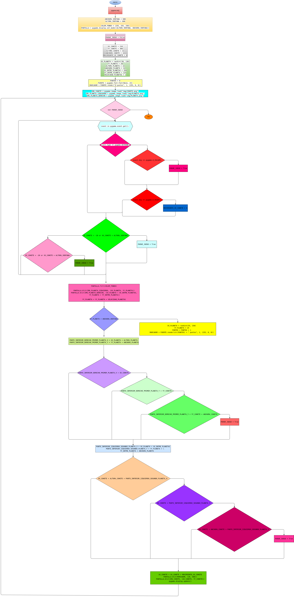

# bimestral_1

import pygame
-   Importa la biblioteca pygame, que es utilizada para crear videojuegos en Python.

from random import randint
-   Importa la función randint del módulo random para generar números aleatorios, usada aquí para la posición aleatoria de los planetas.

pygame.init()
-    Inicializa todos los módulos de pygame. Es necesario llamarlo antes de usar cualquier funcionalidad de Pygame.

ANCHURA_VENTANA = 600
ALTURA_VENTANA = 600
-    Define el tamaño de la ventana del juego en píxeles (600x600).

COLOR_FONDO = (255, 255, 250)
-    Define el color de fondo de la ventana en formato RGB. En este caso, un tono cercano al blanco.

PANTALLA = pygame.display.set_mode((ALTURA_VENTANA, ANCHURA_VENTANA))
-    Establece el tamaño de la ventana del juego, pasándole el tamaño definido anteriormente. Aquí se usa set_mode para crear la ventana de juego.

PARAR_JUEGO = False
-    Define un flag (booleano) que controlará el bucle principal del juego. Se pondrá en True cuando el juego deba terminar.

XX_COHETE = 210
YY_COHETE = 300
ALTURA_COHETE = 32
ANCHURA_COHETE = 32
MOVIMIENTO_XX_COHETE = 0
-   XX_COHETE, YY_COHETE: Posición inicial del cohete en el eje X y Y.

-   ALTURA_COHETE, ANCHURA_COHETE: Tamaño del cohete (32x32 píxeles).

-   MOVIMIENTO_XX_COHETE: Variable que almacena la velocidad de movimiento del cohete en el eje X.

XX_PLANETA = randint(30, 130)
YY_PLANETA = 20
ALTURA_PLANETA = 32
ANCHURA_PLANETA = 32
XX_ENTRE_PLANETAS = 350
YY_ENTRE_PLANETA = 125
VELOCIDAD_PLANETAS = 2
-   XX_PLANETA, YY_PLANETA: Posición inicial del primer planeta (generado aleatoriamente en X).

-   ALTURA_PLANETA, ANCHURA_PLANETA: Tamaño de los planetas (32x32 píxeles).

-   XX_ENTRE_PLANETAS, YY_ENTRE_PLANETA: Desplazamientos adicionales para ubicar el segundo planeta.

-   VELOCIDAD_PLANETAS: Velocidad a la que los planetas se mueven hacia abajo.

PUNTOS = 0
FUENTE = pygame.font.Font(None, 24)
MARCADOR = FUENTE.render("0 puntos", 1, (255, 0, 0))
PUNTOS: Almacena la cantidad de puntos que el jugador ha acumulado.

-   FUENTE: Crea un objeto de fuente para mostrar el texto en pantalla, con un tamaño de 24 píxeles.

-   MARCADOR: Renderiza el texto con los puntos obtenidos usando la fuente.

IMG_COHETE = pygame.image.load("img/COHETE.png")
IMG_PLANETA_IZQUIERDO = pygame.image.load("img/PLANETA.png")
IMG_PLANETA_DERECHO = pygame.image.load("img/PLANETA.png")
-   Carga las imágenes de los objetos en el juego: el cohete y los planetas.

pygame.display.set_caption("PRIMER JUEGO")
-   Establece el título de la ventana del juego.

while not PARAR_JUEGO:
-   Inicia el bucle principal del juego, que se ejecutará hasta que PARAR_JUEGO sea True.

for event in pygame.event.get():
    if event.type == pygame.KEYDOWN:
        if event.key == pygame.K_ESCAPE:
            PARAR_JUEGO = True
        if event.key == pygame.K_RIGHT:
            MOVIMIENTO_XX_COHETE = 4
    elif event.type == pygame.KEYUP:
         MOVIMIENTO_XX_COHETE = -4
-   pygame.event.get(): Obtiene todos los eventos (como pulsaciones de teclas).

-   Si se presiona la tecla Escape, el juego termina (PARAR_JUEGO = True).

-   Si se presiona la tecla de la flecha derecha, el cohete empieza a moverse hacia la derecha.

-   Cuando se suelta una tecla, el cohete se mueve en la dirección opuesta.

if XX_COHETE < -10 or XX_COHETE > ALTURA_VENTANA:
    PARAR_JUEGO = True
-   Si el cohete se mueve fuera de los límites de la ventana, el juego se detiene.

PANTALLA.fill(COLOR_FONDO)
-   Rellena toda la pantalla con el color de fondo antes de dibujar cualquier cosa.

PANTALLA.blit(IMG_PLANETA_IZQUIERDO, (XX_PLANETA, YY_PLANETA))
PANTALLA.blit(IMG_PLANETA_DERECHO, (XX_PLANETA + XX_ENTRE_PLANETAS, YY_PLANETA + YY_ENTRE_PLANETA))
-   Dibuja los planetas en la pantalla en las posiciones especificadas

YY_PLANETA = YY_PLANETA + VELOCIDAD_PLANETAS
-   Mueve los planetas hacia abajo en la pantalla.

if YY_PLANETA > ANCHURA_VENTANA:
    XX_PLANETA = randint(55, 150)
    YY_PLANETA = 25
    PUNTOS = PUNTOS + 1
    MARCADOR = FUENTE.render(str(PUNTOS) + " puntos", 1, (255, 0, 0))
-   Si los planetas alcanzan el final de la pantalla, se reposicionan en la parte superior y se incrementan los puntos del jugador.

PUNTO_INFERIOR_DERECHO_PRIMER_PLANETA_X = XX_PLANETA + ALTURA_PLANETA
PUNTO_INFERIOR_DERECHO_PRIMER_PLANETA_Y = YY_PLANETA + ANCHURA_PLANETA
-   Calcula el punto inferior derecho del primer planeta para verificar la colisión.

if PUNTO_INFERIOR_DERECHO_PRIMER_PLANETA_X > XX_COHETE:
    if PUNTO_INFERIOR_DERECHO_PRIMER_PLANETA_Y > YY_COHETE:
        if PUNTO_INFERIOR_DERECHO_PRIMER_PLANETA_Y < YY_COHETE + ANCHURA_COHETE:
            PARAR_JUEGO = True
-   Verifica si hay colisión entre el cohete y el primer planeta. Si el cohete colisiona, el juego se detiene.

PUNTO_INFERIOR_IZQUIERDO_SEGUNDO_PLANETA_X = XX_PLANETA + XX_ENTRE_PLANETAS
PUNTO_INFERIOR_IZQUIERDO_SEGUNDO_PLANETA_Y = YY_PLANETA + YY_ENTRE_PLANETA + ANCHURA_PLANETA
-   Calcula el punto inferior izquierdo del segundo planeta para verificar la colisión.

if XX_COHETE + ALTURA_COHETE > PUNTO_INFERIOR_IZQUIERDO_SEGUNDO_PLANETA_X:
    if XX_COHETE < PUNTO_INFERIOR_IZQUIERDO_SEGUNDO_PLANETA_Y:
        if XX_COHETE + ANCHURA_COHETE > PUNTO_INFERIOR_IZQUIERDO_SEGUNDO_PLANETA_Y:
            PARAR_JUEGO = True
-   Verifica la colisión entre el cohete y el segundo planeta. Si hay colisión, el juego se detiene.

XX_COHETE = XX_COHETE + MOVIMIENTO_XX_COHETE
-   Mueve el cohete a la derecha o a la izquierda según la variable MOVIMIENTO_XX_COHETE.

PANTALLA.blit(MARCADOR, (20, 580))
PANTALLA.blit(IMG_COHETE, (XX_COHETE, YY_COHETE))
-   Dibuja el marcador de puntos y el cohete en sus nuevas posiciones.

pygame.display.update()
-   Actualiza la pantalla para mostrar los cambios.

## diagrama de flujo

